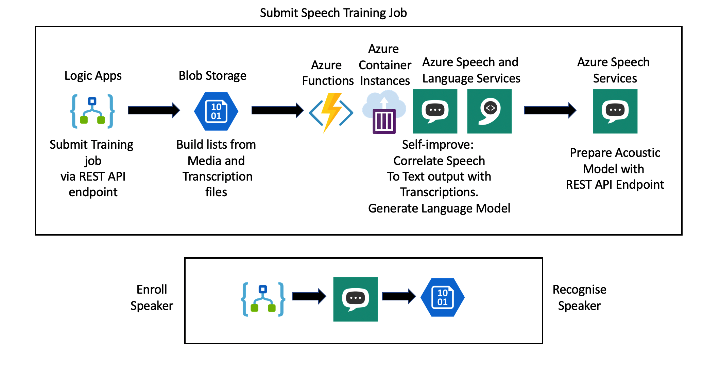
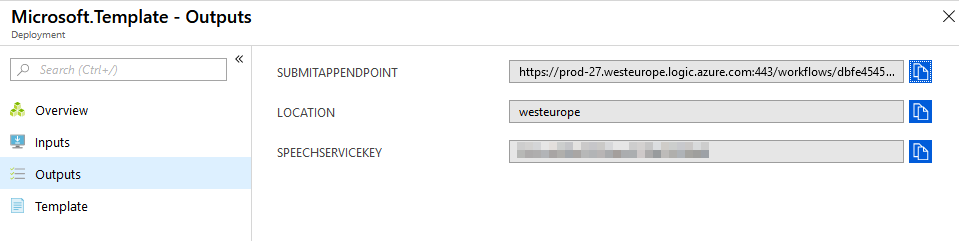
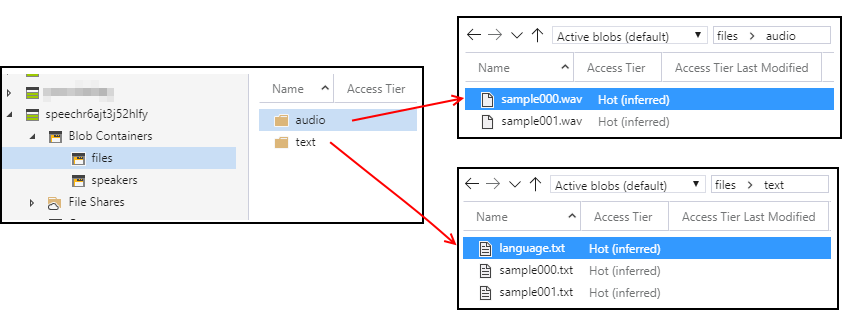

# Speech Training Pipeline

We've built this pipeline to simplify the process of preparing and training a speech to text (STT) models for the [Speech Service](https://docs.microsoft.com/en-us/azure/cognitive-services/speech-service/overview), which is part of [Microsoft Azure](https://azure.microsoft.com/en-us/).

The goal is to simplify data preparation and lower the barrier of entry overall as working with speech and video models can be very time consuming.

With this pipeline you only need to provide full audio files and full transcripts, along with Speech Service keys, and wait for custom speech model to be created. We will do everything else for you like splitting your file, removing silences, converting your file to efficient sample rates, matching your transcript to Azure Speech Services for self-learning and iterating to train and improve the accoustic and language models.

Additional improvements in quality can be achieved by running multiple iterations. Furthermore, we have included a speaker enrollment and speaker recognition function so that voices can be identified by friendly names. The following components will be deployed to your Azure subscription:




**This README is work in progress. Bear with us until we finish it :)**

## How to use

Before you can use the pipeline, you have to provision all necessary resources in your Azure subscription.

1. [Create Resource Group and Service Principal](#create-resource-group-and-service-principal)
2. [Deploy required resources to Azure](#deploy-to-azure)
3. [Use the pipeline](#use-the-pipeline)

### Create Resource Group and Service Principal

In this we will be creating the Resource Group and the Service Principal that has the rights to create Azure resources within the provisioned Resource Group. 

There are two ways: **Bash script** or **Azure Portal**.

#### Bash

> **Requirements:** To run the deployment script to create the Resource Group and Service Principal required for this solution, you will need to have the [Azure CLI](https://docs.microsoft.com/en-us/cli/azure/install-azure-cli?view=azure-cli-latest) installed.

1. Log in to the Azure CLI
2. Run script [createRGandSP.sh](https://github.com/msimecek/Speech-Training-Pipeline/blob/shane-doc/Scripts/createRGandSP.sh)
3. Copy the values output by the script as you will need them in the ARM deploy step

The output should look like the following:

```
{
  "id": "/subscriptions/**************************/resourceGroups/speech16",
  "location": "westeurope",
  "managedBy": null,
  "name": "speech16",
  "properties": {
    "provisioningState": "Succeeded"
  },
  "tags": null
}
Created resource group speech16
Retrying role assignment creation: 1/36
Retrying role assignment creation: 2/36
Created SP with appid 6b84e051-*****************
SP key 62a************************
```

If at any time you need to get the values of the Service Principal, you can simply run the script [SpeechPipelineUtils.sh](https://github.com/msimecek/Speech-Training-Pipeline/blob/shane-doc/Scripts/SpeechPipelineUtils.sh) although this is best run after the Deploy from ARM step.

#### Azure Portal

Alternatively, you can create both the Resource Group and Service Principal through the [Azure management portal](https://portal.azure.com). Choose the **Contributor** role for the principal.

1. Log in to https://portal.azure.com
2. Make sure you are in the right subscription
3. Go to **All services**
4. Find **Azure Active Directory**
5. Go to **App registrations**
6. Click **+ New application registration**
7. Choose a **name** for your application (service principal), keep **Web app / API** as the application type and enter **any valid URL** into the Sign-on URL field
8. Click **Create** and wait for the application to be created
9. Once it's done, open the registered app, copy the **Application ID** value and store it somewhere
10. Click **Settings**
11. Select **Keys** and create new key in the **Passwords** section
12. After you click **Save** new password will be generated - **store it somewhere** to be able to use it later
13. Create **new Resource Group**
14. Go to the group and select **Access Control (IAM)** from the menu
15. Click **+ Add role assignment**
16. Select **Contributor** as role
17. Use the **Select** field to search for your service principal (application created before)
18. Confirm by clicking **Save**

Now you have both the application ID and password (key) for the Service Principal.

### Deploy to Azure

<a href="https://portal.azure.com/#create/Microsoft.Template/uri/https%3A%2F%2Fraw.githubusercontent.com%2Fmsimecek%2FSpeech-Training-Pipeline%2Fmaster%2FARM%2FSpeechPipeline.json" target="_blank">
 
</a>

<a href="http://armviz.io/#/?load=https%3A%2F%2Fraw.githubusercontent.com%2Fmsimecek%2FSpeech-Training-Pipeline%2Fmaster%2FARM%2FSpeechPipeline.json" target="_blank">
 
</a>

The <b>deploy button</b> above automatically provisions the needed Azure services for the Speech training pipeline from an [ARM template](https://github.com/msimecek/Speech-Training-Pipeline/blob/master/ARM/SpeechPipeline.json). The <b>visualise button</b> above displays a visual representation of the services that are to be provisioned from the template.

Upon provisioning the deployment - the settings of the services can be edited to better reflect meaningful identifiers within your specific use case. 

* `Deployment Name`: If multiple instances planned, change to indicate the specific pipeline. This will dynamically change subsequently generated service names to mitigate naming conflicts.

When the deployment completes, you can go to the **Outputs** section and get important parameters which will be used to start the process.



### Use the pipeline

With the infrastructure provisioned, you will need to upload training files to Blob Storage and call the Submit Logic App.

#### Prepare data

The training process uses audio samples along with their respective transcripts to train the speech to text model. Before you start the training process you will need two sets of data:

* **Audio** - should be full audio recordings that you want to use for training. 
  * can be multiple files (for example several sports matches)
  * can be in any of the common formats (WAV, MP3, MP4...)
  * can be audio-only or with video (visual part will be ignored during the process)
  * should represent the audio environment in which the model will be used (that is with background noise, difficult accents etc.)
  * recommended total length is no less than 3 hours
* **Transcripts** - should be full transcript of each of the audio files.
  * needs to be plain text (TXT)
  * needs to be encoded as UTF-8 BOM
  * should not contain any UTF-8 characters above U+00A1 in the [Unicode characters table](http://www.utf8-chartable.de/), typically `–`, `‘`, `‚`, `“` etc. (curly characters produced by Microsoft Word)
  * needs to have the same filename as respective audio file

#### Upload to storage

The ARM deployment has created a **Storage Account** in Azure for you. What you need to do next is:

* create an `audio` folder and upload all your audio files to it
* create a `text` folder and upload all transcript files to it
* if a language model file will be used, rename it to `language.txt` and add it to the `text` folder

> **Hint**: Use [Azure Storage Explorer](https://azure.microsoft.com/en-us/features/storage-explorer/) to manage storage accounts and upload/download files.



#### Start process

The process is triggered by calling the Submit Logic App with **HTTP POST** request. You can find the URL in **Outputs** section of the ARM template deployment.

> Alternatively you can go to the **Overview** section in the Logic App, click **See trigger history** and copy the **Callback URL**.

Request schema can be found in the definition of the Logic App, sample minimal request is here:

```json
{
	"audioBlobLocation": "/files/audio",
	"textBlobLocation": "/files/text",
    "containerImage": "msimecek/speech-pipeline:0.18-full",
    "location": "northeurope",
    "processName": "process16",
    "removeSilence": "true",
    "speechKey": "44564654keykey5465456"
}
```

`audioBlobLocation` and `textBlobLocation` should be paths relative to the Storage Account root.

If you don't specify `containerImage`, default will be used (which is the latest image). See [DockerHub](https://hub.docker.com/r/msimecek/speech-pipeline/tags/) to find more versions.

`processName` is important, because it identifies this particular pipeline through the whole process. It's also required in different steps.

`speechKey` is required at this moment, but could be added automatically from ARM in the future. Get it from the Speech service resource provisioned as part of the whole infrastructure.

Don't forget to set the **Content-Type** to `application/json`.

It will take a few seconds, but if everything went successfuly, you should get similar response:

```
Submitted process process16
```

This means that the process has started. It will take several hours to complete.

#### Process end

Once the process finishes, the container instance is automatically removed and logs are uploaded to the speech Storage Account.

### Troubleshooting

Is there a new resource in your Resource Group with the name of your `processName` and type `Container Instances`? If not, something happened between Logic Apps and Function Apps.

1. Check that your service principal has the **Contributor** role in your resource group.
2. Verify that the Application Settings in the Function App were propagated correctly (`AzureTenantId`, `Location`, `PrincipalAppId`, `PrincipalAppSecret`, `ResourceGroupName`).
3. Check that you uploaded both the audio and transcript files in correct Storage folders.

If the container was started, but you don't see any speech models on the CRIS portal, check logs on the container.

```
az container logs -g resourcegroupname -n process16
```

1. Make sure that you use the correct Speech service key.
2. Make sure that you specified the right region when you started the Logic App (parameter `location` needs to be the same as your Speech service's location).

## Components and in depth description

### Azure Blob Storage

A standard LRS Blob storage account will be created with two blob containers, namely media and files. These blobs will be referenced by the Logic Apps

### Logic Apps

We use Azure Logic Apps to orchestrate the process. They're invoked by HTTP request with parameters in JSON body.

#### The Submit Logic App

This Logic App handles the model deployment and generates URIs for the files in blob storage.

 

When called from the specified endpoint with given parameters, the logic app generates a URI for the items in blob storage specified with the `audioBlobLocation` and `textBlobLocation` parameters. The logic app then passes the URI alongside various other environment variables to the container, spinning up the process.

*Sample request*

```json
{
	"audioBlobLocation": "/files/audio",
	"textBlobLocation": "/files/text",
    "containerImage": "msimecek/speech-pipeline:0.18-full",
    "location": "northeurope",
    "speechKey": "aaabbbcccddddeeee",
    "processName": "process16",
    "removeSilence": "true",
    "testPercentage": "10",
    "chunkLength": "10"
}
```

Full list of inputs can be found [in the ARM template](https://github.com/msimecek/Speech-Training-Pipeline/blob/4a0d0ca430a49b5ceb7622ff6ce0523ae3195058/ARM/SpeechPipeline.json#L731).

*Outputs*

A POST request which initialises the container with the audio files and process name.

 #### The Enroll Logic App

This Logic App will enroll a speaker by using a short clip of their voice. See [Speaker Recognition](https://azure.microsoft.com/en-us/services/cognitive-services/speaker-recognition/) for more information


The enrollment service will return a GUID upon successful registration and the Logic App will write a file to blob storage that will reference the speaker's name to the enrolled voice. This is simply an example implementation, a more efficient implementation would be to export and run this model locally in a container and store the speaker GUID to speaker name in memory for more real time speaker identification.

*Inputs*
```
    "properties": {
        "fileURL": { 'This is the url of the voice file you want to enroll
            "type": "string"
        },
        "jobName": { 'This is the name of the process so that you can monitor it
            "type": "string"
        },
        "shortAudio": { 'Instruct the service to waive the recommended minimum audio limit needed for enrollment. Set value to “true” to force enrollment using any audio length (min. 1 second).
            "type": "string"
        },
        "speakerName": { 'The name of the person you want to enroll
            "type": "string"
        },
        "speakerURL": { 'The endpoint for the Speaker Cognitive Service - see https://westus.dev.cognitive.microsoft.com/docs/services/563309b6778daf02acc0a508/operations/5645c3271984551c84ec6797
            "type": "string"
        },
        "speechKey": { 'Your Speaker Recognition Cognitive Services key
            "type": "string"
        }
    },
    "type": "object"
}
```

*Outputs*

The logic app will output the GUID from the enrollment service and write a GUID/Speaker reference blob to storage.

#### The Recognise Logic App

This Logic App will recognise a speaker by using a short clip of a voice. See [Speaker Recognition](https://azure.microsoft.com/en-us/services/cognitive-services/speaker-recognition/) for more information  

 

The recognise service will return a GUID upon successful identification and the Logic App will read a file from blob storage that will retrieve the reference to the speaker's name. This is simply an example implementation, a more efficient implementation would be to export and run this model locally in a container and store the speaker GUID to speaker name in memory for more real time speaker identification.

*Inputs*
```
{
    "properties": {
        "fileURL": {
            "type": "string"
        },
        "identificationProfileIds": { 'These are the GUIDS of all the candidate speakers currently enrolled
            "type": "string"
        },
        "shortAudio": { 'Instruct the service to waive the recommended minimum audio limit needed for enrollment. Set value to “true” to force enrollment using any audio length (min. 1 second).
            "type": "string"
        },
        "speakerURL": { 'The endpoint for the Speaker Cognitive Service - see https://westus.dev.cognitive.microsoft.com/docs/services/563309b6778daf02acc0a508/operations/5645c523778daf217c292592
            "type": "string"
        },
        "speechKey": { 'Your Speaker Recognition Cognitive Services key
            "type": "string"
        }
    },
    "type": "object"
}
```
*Outputs*

The name of the speaker as retrieved from the blob storage file matching the speaker GUID

###  Function App (Pipeline Manager)

The training pipeline itself is a Docker container and we run it on demand in [Azure Container Instances](https://azure.microsoft.com/en-us/services/container-instances/).

Pipeline container is provisioned when the process is initiated and after input files are processed. Container provisioning is represented by an HTTP POST call to an Azure Function, which is deployed [from GitHub repo](https://github.com/msimecek/Pipeline-Manager).

This Function App is fairly simple - it uses Azure Management NuGet package (`Microsoft.Azure.Management.Fluent`) to create and remove Container Groups in the same Resource Group where the whole process runs.

**Configuration**

> **Note:** All of these settings are filled automatically when deploying  with Azure Resource Manager.

In addition to standard Function App settings (`AzureWebJobsStorage` etc.) these environment variables / application settings are required:

* `PrincipalAppId`: Application/Client ID of the service principal you use.
* `PrincipalAppSecret`: Password/secret of the service principal application.
* `AzureTenantId`: This value is returned by the `subscription().tenantId` statement in Resource Manager. Or you can get it from the Subscription section in the Azure portal.
* `ResourceGroupName`: In which Resource Group is the pipeline container supposed to run.
* `Location`: In which region is the pipeline container supposed to run.
* `LogStorageConnectionString`: Connection string to Storage Account where logs will be uploaded. A container called "logs" is expected.

**Functions:**

| Function    | Trigger   | Expected inputs                                              |
| ----------- | --------- | ------------------------------------------------------------ |
| Start       | HTTP POST | JSON request body with `containerImage`, `pipeline.processName` and any of the pipieline settings (see example below). |
| StartWorker | Queue     | Storage Queue message with `ContainerName`, `Location`, `ResourceGroup`, `ContainerImage` and `Env`. |
| Remove      | HTTP POST | JSON request body with `ProcessName`.                        |

`Start` input parameters are parsed first - all values starting with `pipeline.` are passed as ENV variables to the contaier (without the *pipeline.* part).

Becuase `Start` is designed to return as fast as possible, it enqueues a message with all parameters and then returns HTTP 202 Accepted. `StartWorker` then takes on and uses Azure Management SDK to provision the container.

```csharp
var containerGroup = azure.ContainerGroups.Define(startmessage.ContainerName)
    .WithRegion(startmessage.Location)
    .WithExistingResourceGroup(startmessage.ResourceGroup)
    .WithLinux()
    .WithPublicImageRegistryOnly()
    .WithoutVolume()
    .DefineContainerInstance("pipeline")
    	.WithImage(startmessage.ContainerImage)
    	.WithoutPorts()
    	.WithCpuCoreCount(2)
    	.WithMemorySizeInGB(3.5)
    	.WithEnvironmentVariables(startmessage.Env)
    	.Attach()
    	.WithRestartPolicy(ContainerGroupRestartPolicy.Never)
    	.Create();
```

Our test runs show that optimal amount of container RAM is 3.5 GB with CPU count 2.

**Examples:**

*POST /api/Start*

```json
{
  "containerImage": "msimecek/speech-pipeline:0.16-full",
  "pipeline.processName": "mujproces",
  "pipeline.audioFilesList": "https://storageacc.blob.core.windows.net/files/text/language.txt?sv=..saskey",
  "pipeline.transcriptFilesList": "https://storageacc.blob.core.windows.net/files/text/textInput.txt?sv=..saskey",
  "pipeline.languageModelFile": "https://storageacc.blob.core.windows.net/files/text/language.txt?sv=..saskey",
  "pipeline.languageModelId": "",
  "pipeline.speechEndpoint": "",
  "pipeline.speechKey": "44564654keykey5465456",
  "pipeline.speechRegion": "northeurope",
  "pipeline.chunkLength": "",
  "pipeline.testPercentage": "",
  "pipeline.removeSilence": "true",
  "pipeline.silenceDuration": "",
  "pipeline.silenceThreshold": "",
  "pipeline.webhookUrl": "",
  "pipeline.webhookContent": ""
}
```

*POST /api/Remove*

```json
{
	"ProcessName": "mujproces",
	"Errors": null,
	"Content": null
}
```

### Cognitive Services

As the name suggests the speech training pipeline works with speech-related services. Specifically [Speech](https://azure.microsoft.com/en-us/services/cognitive-services/speech-to-text/) service and [Speaker Recognition](https://azure.microsoft.com/en-us/services/cognitive-services/speaker-recognition/) service. Both are part of [Azure Cognitive Services](https://azure.microsoft.com/en-us/services/cognitive-services/?v=18.44b), a set of RESTful APIs which are easy to integrate into any application.

> **Note:** If you search for Azure Speech service, you may find several offerings (Custom Speech, Bing Speech etc.). We're using the unified Speech service which replaces them all.

We recommend using the **Standard (S0)** tier for both services, because the pipeline process is quite intensive on API calls and Free tier usually hits its limit. Our ARM template uses **S0** by default.

Once you create your services, you can manage your Speech entities using a web portal or unofficial CLI tool.

**Portal**

First get your Speech key from the Azure Portal


You can also get your keys by running the script [SpeechPipelineUtils.sh](https://github.com/msimecek/Speech-Training-Pipeline/blob/shane-doc/Scripts/SpeechPipelineUtils.sh).

Then navigate to https://cris.ai, sign in and connect your subscription. If your Speech service wasn't provisioned in the US, add your region to the URL (such as https://northeurope.cris.ai).


If the connection passes, you will be able to see and manage all of the resources created by the training pipeline.

**CLI**

To get the unofficial Speech CLI tool, go to the [GitHub repo](https://github.com/msimecek/Azure-Speech-CLI), open **Releases** and download a ZIP archive of a version for your operating system (Windows, Mac or Linux).

Configure it with your Speech key and region:

```
speech config set --name Pipeline --key 44564654keykey5465456 --region northeurope --select
```

Then you can work with datasets, models, tests, endpoints or transcripts:

```
speech dataset list
speech model list
speech test list
speech endpoint list
speech transcript list
etc.
```


## Todo
* Consider adding a monitoring solution - for example, you can use the Log Analytics Send step within the Logic Apps to track the job steps. There is also a Logic Apps Management workspace solution that you can import into Log Analytics to capture operational traces.

## References

This pipeline references two other repos:

* [Custom Speech Processing Pipeline](https://github.com/shanepeckham/CustomSpeech-Processing-Pipeline)
* [Azure Speech CLI](https://github.com/msimecek/Azure-Speech-CLI)

To learn how work with the trained endpoint, look at [Speech Service](https://docs.microsoft.com/en-us/azure/cognitive-services/speech-service/) in Microsoft documentation. There are SDKs and samples for UWP, C#, C++, Java, JavaScript etc.
